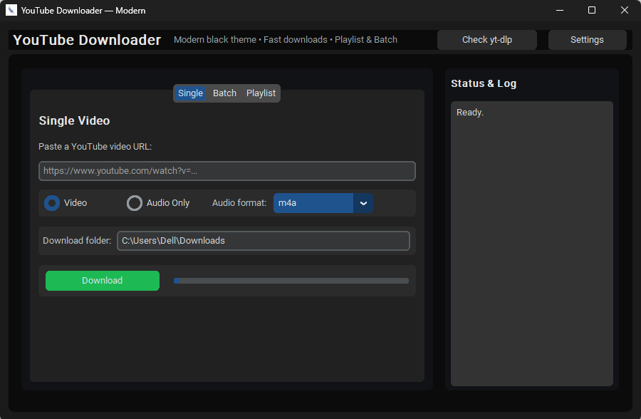
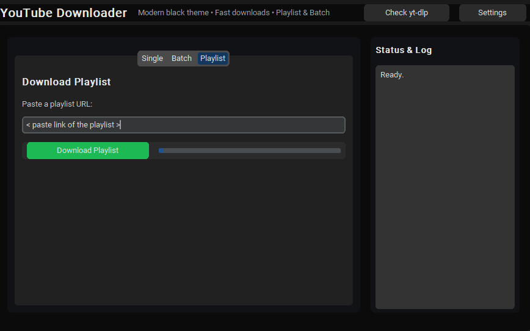
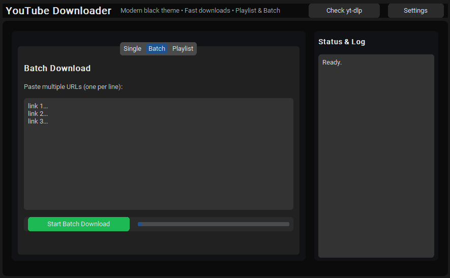

<h1 align="center">🎵 YouTube Downloader – Modern UI</h1>
<p align="center"><b>By Life • MIT License</b></p>

<p align="center">
A beautiful, modern, Spotify-style YouTube downloader built with CustomTkinter.<br/>
Download single videos, playlists, and large batches — all in a clean, dark UI.
</p>

---

<!-- BADGES -->
<p align="center">

<a href="https://github.com/LifeAtul/YouTube-Downloader/releases/latest">
  
</a>

<a href="https://github.com/LifeAtul/YouTube-Downloader/stargazers">
  
</a>

<a href="https://github.com/LifeAtul/YouTube-Downloader">
  
</a>

<a href="LICENSE">
  
</a>

<a href="https://www.python.org/">
  
</a>

<a href="https://github.com/LifeAtul/YouTube-Downloader/actions">
  
</a>

</p>

---

<!-- DOWNLOAD BUTTON -->
<p align="center">
  <a href="https://github.com/LifeAtul/YouTube-Downloader/releases/latest">
    
  </a>
</p>

---

## 📸 Screenshots

<p align="center">
  
  
  
</p>

---

## ✨ Features

✔ Modern CustomTkinter black theme  
✔ No console windows  
✔ Single, batch, and playlist modes  
✔ Drag & drop support (coming soon)  
✔ Auto-update `yt-dlp`  
✔ Batch progress per item  
✔ Playlist progress  
✔ Audio extraction (m4a/mp3)  
✔ Windows EXE auto-build via GitHub Actions  
✔ Feather icon included  
✔ Fully MIT-licensed  
✔ 100% offline standalone EXE support (PyInstaller)  

---

## 📥 Download & Install

🔰 Option 1 — Download Prebuilt EXE (Recommended)

You do NOT need Python, ffmpeg, or yt-dlp.

Go to the Releases page:
👉 https://github.com/LifeAtul/YouTube-Downloader/releases

Download the latest file:
youtube_downloader.exe

Run it — that’s all.

✔ ffmpeg is bundled
✔ yt-dlp is bundled
✔ No installation required
✔ No console window
✔ Auto-update included

---

## 📦 Install (Run from Source)

```bash
pip install customtkinter requests pillow tqdm
````

Run the app:

```bash
python app/youtube_downloader.py
```

---

## 🖥 Build Standalone EXE (PyInstaller)

Go to:

```
YouTube-Downloader/app/
```

Run:

```bash
pyinstaller --noconsole --onefile --windowed --add-data "../ffmpeg;ffmpeg" --add-data "../ytdlp;ytdlp" --add-data "resources;resources" --icon "resources/icon.ico" youtube_downloader.py
```

Your EXE will appear here:

```
app/dist/youtube_downloader.exe
```

Place it next to:

```
ffmpeg/
ytdlp/
```

---

## 🚀 Automatic GitHub Release Builds

Every push to `main` triggers:

* Automated Windows EXE build
* Version tagging
* New release creation
* Logs & artifacts stored in GitHub Actions

Workflow file:

```
.github/workflows/build.yml
```

---

## 🧩 Requirements

See `requirements.txt`:

```
customtkinter
requests
pillow
tqdm
```

---

## 🎨 Customization

* Theme: Dark / Light
* Replace logo:
  `app/resources/logo.png`
* Replace app icon:
  `app/resources/icon.ico`
* ffmpeg auto-download: (coming in future updates)

---

## ❤️ Credits

This project uses the following open-source tools:

| Component         | License     | Link                                                                                             |
| ----------------- | ----------- | ------------------------------------------------------------------------------------------------ |
| **yt-dlp**        | MIT         | [https://github.com/yt-dlp/yt-dlp](https://github.com/yt-dlp/yt-dlp)                             |
| **FFmpeg**        | LGPL/GPL    | [https://ffmpeg.org](https://ffmpeg.org)                                                         |
| **CustomTkinter** | MIT         | [https://github.com/TomSchimansky/CustomTkinter](https://github.com/TomSchimansky/CustomTkinter) |
| **Pillow (PIL)**  | PIL License | [https://python-pillow.org](https://python-pillow.org)                                           |

Special thanks to the open-source community.

---

## 📄 License

This project is licensed under the **MIT License**.
See [`LICENSE`](LICENSE) for full details.

---

## 🤝 Contributing

Pull requests are welcome!
To contribute, see [`CONTRIBUTING.md`](CONTRIBUTING.md).

---

## 🧭 Project Roadmap

Planned features for future releases:

* Drag & drop support
* Built-in ffmpeg updater
* Built-in yt-dlp auto setup
* System tray mini-downloader
* Resume failed downloads
* Advanced format selection panel
* Audio/video quality picker

---

<p align="center">Made with ❤️ by Life</p>
